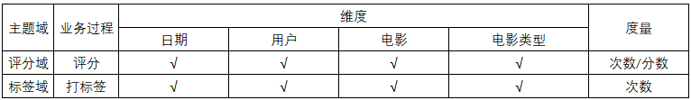
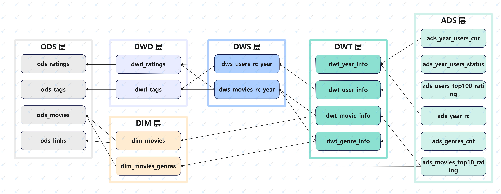
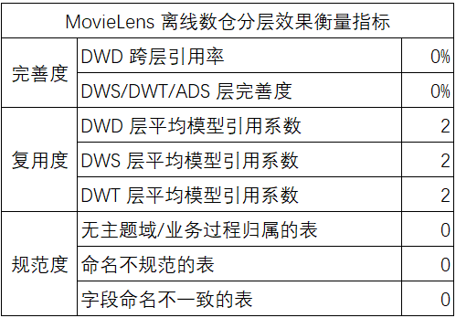
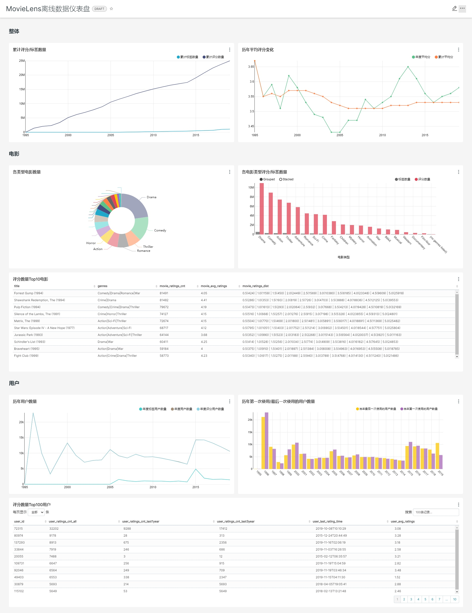

# **MovieLens 离线数仓实施与数据仪表板搭建**

> Author: json.wong.work@gmail.com
>
> Index: https://github.com/jsonww/movielens-offline-data-warehouse


[TOC]


## 项目背景

MovieLens 是一个提供五星评级和免费文本标记电影服务网站，包含 25000095 个评级和 1093360 个标签应用程序，涉及 62423 部电影。这些数据是由 162541 名用户在 1995年1月9日 ~ 2019年11月21日 期间创建的。


## 项目目的

为规范网站的电影评级与文本标记数据存储，并提供数据可视化分析，基于 **Hadoop+Hive** 搭建离线数仓并使用 **Superset** 搭建数据仪表板。

注：本项目中提及的数仓特指离线数仓。


## 数据准备

### 数据源

- 数据集主页：https://grouplens.org/datasets/movielens/
- 数据集文档：https://files.grouplens.org/datasets/movielens/ml-25m-README.html


### 数据解释

1. 评级数据文件（ratings.csv）

   - userId：用户 ID
   - movieId：电影 ID
   - rating：评级，采用 5 星等级，以半星为增量（0.5 星 - 5.0 星）。
   - timestamp：评级时间戳

2. 标签数据文件（tags.csv）

   - userId：用户 ID
   - movieId：电影 ID
   - tag：用户给电影的标签，一个单词或短语
   - timestamp：标签时间戳

3. 电影数据文件（movies.csv）

   - movieId：电影 ID

   - title：电影名称

   - genres：电影类型，仅含以下选项

     ```
     Action | Adventure | Animation | Children's | Comedy | Crime | Documentary | Drama |Fantasy | Film-Noir 
     | Horror | Musical | Mystery | Romance | Sci-Fi | Thriller | War | Western | (no genres listed)
     ```

4. 电影链接数据文件(links.csv）
   - movieId：电影 ID
   - imdbId：[https://movielens.org](https://movielens.org/) 使用的电影 ID。例如，电影《玩具总动员》的链接http://www.imdb.com/title/tt0114709/。
   - tmdbId：[https://www.themoviedb.org](https://www.themoviedb.org/) 使用的电影 ID。例如，电影《玩具总动员》的链接https://www.themoviedb.org/movie/862。


### 项目环境

本次离线数仓项目实施与数据仪表板搭建基于以下版本的环境与工具：

- 操作系统：CentOS 7.5
- 文件系统：Hadoop 3.1.3
- Hadoop 数据库：Hive 3.1.2
- 关系型数据库：MySQL 8.0
- HDFS 与 MySQL 数据传递：Sqoop  1.4.6
- BI 分析工具：Superset


### 数据获取

```shell
# 下载数据
wget -c https://files.grouplens.org/datasets/movielens/ml-25m.zip
# 解压
unzip ml-25m.zip
# 上传至 hdfs
hadoop fs -put ml-25m /upload
```


## 数仓建模

### 主题域划分

根据数据中涉及的维度信息，划分主题域如下：

- 电影主题域
- 电影类型主题域
- 用户主题域
- 年度主题域


### 可视化数据需求

为了解网站历年来用户与业务的数据统计情况，本次仪表板搭建确定的可视化数据需求如下：

1. 历年累计评级/标签数量变化
2. 历年的年度平均评级和累计平均评级变化
3. 各电影类型数量
4. 各电影类型的评级与标签数量
5. 评级数量前十的电影及其评级相关信息
6. 每年评级/标签用户数量变化
7. 每年第一次使用和最近一次使用的用户数量
8. 评级数量前 100 用户及其评级相关信息


### 维度建模

根据数据中的主要业务与相关维度确定一致性维度与一致性事实，绘制总线矩阵如下：




### 数仓分层

为分解复杂任务、减少重复开发，对数仓进行分层，通过中间层提高复用率并方便后期需求拓展。


#### ODS 层

操作：本层创建外部表直接加载原始数据文件，不对原始数据文件作任何修改，仅作备份用途。

注意事项：

- 原始数据文件中的某些字段存在半角逗号`,`，与数据文件格式 csv 的默认分隔符相同，为避免数据加载到 hive 的过程中字段分割错误造成数据混乱，使用 OpenCSVSerde 解析加载数据文件，此时加载的数据字段都是**字符串**类型。

  

#### DWD 层 / DIM 层

操作：

- DWD 层：抽取数据文件中的具体业务过程信息构成行为事实表。
- DIM 层：抽取数据文件中可单独或重复使用的维度信息构成维度表。


#### DWS 层 / DWT 层

为方便后期拓展与提高中间数据的复用率，划分 DWS 层与 DWT 层分别进行面向单一维度的轻度汇总和面向主题的汇总：

- DWS 层：在 DWD 层的业务过程基础上，以年为时间粒度，分别对用户、电影的评级和标签情况进行轻度汇总。
- DWT 层：在 DWS 层的轻度汇总基础上，分别以年度、用户、电影、电影类型为主题进行评级和标签情况的全量汇总。


#### ADS 层

本项目中 ADS 层作为需求方获取数仓统计数据的唯一接口，存放高频需求与应用所需要的数据。每张表单独对应一个需求或应用，经 Sqoop 导出至 MySQL 以供 Superset 搭建数据仪表板。


## 数仓实施

### 命名规范

本次数仓搭建过程中，各层数仓数据库及其数据表的命名规范如下：

|实体|命名规范|
|-|-|
| 数据库 | `ml_<数仓层次>` |
| ODS 层数据表 | `ods_<数据来源>` |
| DWD 层数据表 | `dwd_<业务>` |
| DIM 层数据表 | `dim_<维度>` |
| DWS 层数据表 | `dws_<汇总相关粒度>_<汇总时间周期>` |
| DWT 层数据表 | `dwt_<主题>` |
| ADS 层数据表 | `ads_<统计业务>` |


### ODS 层

1. ods_ratings

   加载评级数据文件（ratings.csv）：

   ```sql
   CREATE DATABASE IF NOT EXISTS ml_ods;
   
   CREATE EXTERNAL TABLE IF NOT EXISTS ml_ods.ods_ratings(
       userId INT      COMMENT '用户id',
       movieId INT     COMMENT '电影id',
       rating FLOAT    COMMENT '评级',
       times BIGINT    COMMENT '评级时间戳'
   ) COMMENT '评级表'
   ROW FORMAT SERDE 'org.apache.hadoop.hive.serde2.OpenCSVSerde'
   WITH SERDEPROPERTIES (
       "separatorChar" = ",",
       "quoteChar" = "\"",
       "escapeChar" = "\\"
   )
   STORED AS TEXTFILE
   LOCATION '/warehouse/ml/ods/ratings'
   TBLPROPERTIES ('skip.header.line.count'='1');
   
   LOAD DATA INPATH "/upload/ml-25m/ratings.csv"
   INTO TABLE ml_ods.ods_ratings;
   ```

   

2. ods_tags

   加载标签数据文件（tags.csv）：

   ```sql
   CREATE DATABASE IF NOT EXISTS ml_ods;
   
   CREATE EXTERNAL TABLE IF NOT EXISTS ml_ods.ods_tags(
       userId  INT     COMMENT '用户id',
       movieId INT     COMMENT '电影id',
       tag     STRING  COMMENT '标签',
       times   BIGINT  COMMENT '标签时间戳'
   ) COMMENT '标签表'
   ROW FORMAT SERDE 'org.apache.hadoop.hive.serde2.OpenCSVSerde'
   WITH SERDEPROPERTIES (
       "separatorChar" = ",",
       "quoteChar" = "\"",
       "escapeChar" = "\\"
   )
   STORED AS TEXTFILE
   LOCATION '/warehouse/ml/ods/tags'
   TBLPROPERTIES ('skip.header.line.count'='1');
   
   LOAD DATA INPATH "/upload/ml-25m/tags.csv"
   INTO TABLE ml_ods.ods_tags;
   ```

   

3. ods_movies

   加载电影数据文件（movies.csv）：

   ```sql
   CREATE DATABASE IF NOT EXISTS ml_ods;
   
   CREATE EXTERNAL TABLE IF NOT EXISTS ml_ods.ods_movies(
       movieId INT     COMMENT '电影id',
       title   STRING  COMMENT '电影标题',
       genres  STRING  COMMENT '电影类型合集'
   ) COMMENT '电影表'
   ROW FORMAT SERDE 'org.apache.hadoop.hive.serde2.OpenCSVSerde'
   WITH SERDEPROPERTIES (
       "separatorChar" = ",",
       "quoteChar" = "\"",
       "escapeChar" = "\\"
   )
   STORED AS TEXTFILE
   LOCATION '/warehouse/ml/ods/movies'
   TBLPROPERTIES ('skip.header.line.count'='1');
   
   LOAD DATA INPATH "/upload/ml-25m/movies.csv"
   INTO TABLE ml_ods.ods_movies;
   
   SELECT
       movieId,
       gen
   FROM
   (
       SELECT
           movieId,
           `genres`
       FROM
           ml_ods.ods_movies
       WHERE
           movieId = 1
   ) AS res
   LATERAL VIEW
       EXPLODE(SPLIT(genres, '\\|')) gen_tmp AS gen;
   ```

   

4. ods_links

   加载电影链接数据文件(links.csv）：

   ```sql
   CREATE DATABASE IF NOT EXISTS ml_ods;
   
   CREATE EXTERNAL TABLE IF NOT EXISTS ml_ods.ods_links(
       movieId INT COMMENT '电影id',
       imdbId  INT COMMENT 'imdb链接 -- http://www.imdb.com/title/<imdbId>/.',
       tmdbId  INT COMMENT 'themoviedb链接 -- https://www.themoviedb.org/movie/<imdbId>.'
   ) COMMENT '链接表'
   ROW FORMAT SERDE 'org.apache.hadoop.hive.serde2.OpenCSVSerde'
   WITH SERDEPROPERTIES (
       "separatorChar" = ",",
       "quoteChar" = "\"",
       "escapeChar" = "\\"
   )
   STORED AS TEXTFILE
   LOCATION '/warehouse/ml/ods/links'
   TBLPROPERTIES ('skip.header.line.count'='1');
   
   LOAD DATA INPATH "/upload/ml-25m/links.csv"
   INTO TABLE ml_ods.ods_links;
   ```

   

### DIM 层

1. dim_movies

   将与电影相关的所有相关维度信息汇总成电影维度信息表：

   ```sql
   CREATE DATABASE IF NOT EXISTS ml_dim;
   
   CREATE EXTERNAL TABLE IF NOT EXISTS ml_dim.dim_movies(
       movie_id    INT     COMMENT '电影id',
       title       STRING  COMMENT '电影标题',
       imdb_id     INT     COMMENT 'imdb链接 -- http://www.imdb.com/title/<imdbId>/.',
       tmdb_id     INT     COMMENT 'themoviedb链接 -- https://www.themoviedb.org/movie/<imdbId>.',
       genres      STRING  COMMENT '电影类型合集'
   ) COMMENT '电影维度表'
   STORED AS PARQUET
   LOCATION '/warehouse/ml/dim/dim_movies/';
   
   INSERT OVERWRITE TABLE ml_dim.dim_movies
   SELECT
       m.movieId AS movie_id,
       m.title AS title,
       l.imdbId AS imdb_id,
       l.tmdbId AS tmdb_id,
       m.genres AS genres 
   FROM
       ml_ods.ods_movies AS m
   LEFT JOIN
       ml_ods.ods_links AS l
   ON
       m.movieId = l.movieId;
   ```

   

2. dim_movies_genres

   为方便上层数仓按电影类型进行汇总统计，将电影的类型集合信息拆分成”电影，单个电影类型”的一一对应形式：

   ```sql
   CREATE DATABASE IF NOT EXISTS ml_dim;
   
   CREATE EXTERNAL TABLE IF NOT EXISTS ml_dim.dim_movies_genres(
       movie_id    INT      COMMENT '电影id',
       genre       STRING   COMMENT '电影类型'
   ) COMMENT '电影类型表'
   STORED AS PARQUET
   LOCATION '/warehouse/ml/dim/dim_movies_genres/';
   
   INSERT OVERWRITE TABLE ml_dim.dim_movies_genres
   SELECT
       movieId AS movie_id,
       gen AS genre
   FROM
       ml_ods.ods_movies AS m
   LATERAL VIEW
       EXPLODE(SPLIT(m.genres, '\\|')) gen_tmp AS gen;  -- SQL 通过 shell 脚本的方式执行， ‘|’ 需要进行转义
   ```

   

### DWD 层

1. dwd_ratings

   抽取评级数据表并对字段进行规范统一命名：

   ```sql
   CREATE DATABASE IF NOT EXISTS ml_dwd;
   
   CREATE EXTERNAL TABLE IF NOT EXISTS ml_dwd.dwd_ratings(
       user_id     INT     COMMENT '用户id',
       movie_id    INT     COMMENT '电影id',
       rating      FLOAT   COMMENT '评级',
       rating_time BIGINT  COMMENT '评级时间戳'
   ) COMMENT '评级表'
   STORED AS PARQUET
   LOCATION '/warehouse/ml/dwd/dwd_ratings/';
   
   INSERT OVERWRITE TABLE ml_dwd.dwd_ratings
   SELECT
       userId AS user_id,
       movieId AS movie_id,
       rating,
       times AS rating_time
   FROM
       ml_ods.ods_ratings;
   ```

   

2. dwd_tags

   抽取标签数据表并对字段进行规范统一命名：

   ```sql
   CREATE DATABASE IF NOT EXISTS ml_dwd;
   
   CREATE EXTERNAL TABLE IF NOT EXISTS ml_dwd.dwd_tags(
       user_id     INT     COMMENT '用户id',
       movie_id    INT     COMMENT '电影id',
       tag         STRING  COMMENT '标签',
       tag_time    BIGINT  COMMENT '标签时间戳'
   ) COMMENT '标签表'
   STORED AS PARQUET
   LOCATION '/warehouse/ml/dwd/dwd_tags/';
   
   INSERT OVERWRITE TABLE ml_dwd.dwd_tags
   SELECT
       userId AS user_id,
       movieId AS movie_id,
       tag,
       times AS tag_time
   FROM
       ml_ods.ods_tags;
   ```

   

### DWS 层

1. dws_movies_rc_year

   以年为时间粒度，以电影为主体，对电影的评级和标签相关数据进行汇总。

   ```sql
   CREATE DATABASE IF NOT EXISTS ml_dws;
   
   CREATE EXTERNAL TABLE IF NOT EXISTS ml_dws.dws_movies_rc_year (
       year        	SMALLINT    COMMENT '年份',
       movie_id    	INT         COMMENT '电影id',
       ratings_cnt 	INT			COMMENT '评级数',
       avg_ratings		FLOAT      	COMMENT '评级',
   	min_rating_time	BIGINT      COMMENT '最早评级时间',
       max_rating_time	BIGINT      COMMENT '最近评级时间',
       tags_cnt		INT      	COMMENT '标签数',
   	min_tag_time	BIGINT      COMMENT '最早标签时间',
       max_tag_time	BIGINT      COMMENT '最近标签时间'
   ) COMMENT '电影历年评级标签汇总'
   STORED AS PARQUET
   LOCATION '/warehouse/ml/dws/dws_movies_rc_year/';
   
   WITH
   tmr AS (
   	SELECT 
   		FROM_UNIXTIME(rating_time, 'yyyy') AS year,
   		movie_id,
   		COUNT(*) AS ratings_cnt, 
   		ROUND(AVG(rating), 2) AS avg_ratings,
           MIN(rating_time) AS min_rating_time,
           MAX(rating_time) AS max_rating_time
   	FROM 
   		ml_dwd.dwd_ratings
   	GROUP BY
   		FROM_UNIXTIME(rating_time, 'yyyy'),
   		movie_id
   ),
   tmt AS (
   	SELECT 
   		FROM_UNIXTIME(tag_time, 'yyyy') AS year,
   		movie_id,
   		COUNT(*) AS tags_cnt,
           MIN(tag_time) AS min_tag_time,
           MAX(tag_time) AS max_tag_time
   	FROM 
   		ml_dwd.dwd_tags
   	GROUP BY
   		FROM_UNIXTIME(tag_time, 'yyyy'),
   		movie_id 
   )
   INSERT overwrite TABLE ml_dws.dws_movies_rc_year
   SELECT
   	COALESCE(tmr.year, tmt.year) AS year,
   	COALESCE(tmr.movie_id, tmt.movie_id) AS movie_id,
   	NVL(tmr.ratings_cnt, 0) AS ratings_cnt,
   	NVL(tmr.avg_ratings, 0) AS avg_ratings,
       tmr.min_rating_time,
       tmr.max_rating_time,
   	NVL(tmt.tags_cnt, 0) AS tags_cnt,
   	tmt.min_tag_time,
       tmt.max_tag_time
   FROM
   	tmr
   FULL OUTER JOIN
   	tmt
   ON
   	tmr.year = tmt.year AND tmr.movie_id = tmt.movie_id;
   ```

   

2. dws_users_rc_year

   以年为时间粒度，以用户为主体，对用户的评级和标签相关数据进行汇总。

   ```sql
   CREATE DATABASE IF NOT EXISTS ml_dws;
   
   CREATE EXTERNAL TABLE IF NOT EXISTS ml_dws.dws_users_rc_year (
       last_i_year		TINYINT    	COMMENT '最近第几年',
   	year        	SMALLINT    COMMENT '年份',
       user_id     	INT         COMMENT '用户id',
       ratings_cnt 	INT			COMMENT '评级数',
       avg_ratings		FLOAT      	COMMENT '评级',
       min_rating_time	BIGINT      COMMENT '最早评级时间',
       max_rating_time	BIGINT      COMMENT '最近评级时间',
       tags_cnt 		INT			COMMENT '标签数',
   	min_tag_time	BIGINT      COMMENT '最早标签时间',
       max_tag_time	BIGINT      COMMENT '最近标签时间'
   ) COMMENT '用户历年评级标签汇总'
   STORED AS PARQUET
   LOCATION '/warehouse/ml/dws/dws_users_rc_year/';
   
   WITH
   tur AS (
   	SELECT 
   		FROM_UNIXTIME(rating_time, 'yyyy') AS year,
   		user_id,
   		COUNT(*) AS ratings_cnt, 
   		ROUND(AVG(rating), 2) AS avg_ratings,
           MIN(rating_time) AS min_rating_time,
           MAX(rating_time) AS max_rating_time
   	FROM 
   		ml_dwd.dwd_ratings
   	GROUP BY
   		FROM_UNIXTIME(rating_time, 'yyyy'),
   		user_id
   ),
   tut AS (
   	SELECT 
   		FROM_UNIXTIME(tag_time, 'yyyy') AS year,
   		user_id,
   		COUNT(*) AS tags_cnt,
           MIN(tag_time) AS min_tag_time,
           MAX(tag_time) AS max_tag_time 
   	FROM 
   		ml_dwd.dwd_tags
   	GROUP BY
   		FROM_UNIXTIME(tag_time, 'yyyy'),
   		user_id 
   )
   INSERT overwrite TABLE ml_dws.dws_users_rc_year
   SELECT
   	ROW_NUMBER() OVER (PARTITION BY res.user_id ORDER BY res.year DESC) AS last_i_year,
   	res.*
   FROM
   (
   	SELECT
   		COALESCE(tur.year, tut.year) AS year,
   		COALESCE(tur.user_id, tut.user_id) AS user_id,
   		NVL(tur.ratings_cnt, 0) AS ratings_cnt,
   		NVL(tur.avg_ratings, 0) AS avg_ratings,
   		tur.min_rating_time AS min_rating_time,
   		tur.max_rating_time AS max_rating_time,
   		NVL(tut.tags_cnt, 0) AS tags_cnt,
   		tut.min_tag_time AS min_tag_time,
   		tut.max_tag_time AS max_tag_time
   	FROM
   		tur
   	FULL OUTER JOIN
   		tut
   	ON
   		tur.year = tut.year AND tur.user_id = tut.user_id
   ) AS res;
   ```

   

3. dws_movie_ratings

   汇总电影的历史评级集合信息（电影的评级、相应的次数，并按评级大小升序排序）。

   ```sql
   CREATE DATABASE IF NOT EXISTS ml_dws;
   
   CREATE EXTERNAL TABLE IF NOT EXISTS ml_dws.dws_movie_ratings (
       movie_id            INT     COMMENT '电影id',
       movie_ratings_dist  STRING  COMMENT '电影评级分布'
   ) COMMENT '电影评级分布表'
   STORED AS PARQUET
   LOCATION '/warehouse/ml/dws/dws_movie_ratings/';
   
   INSERT OVERWRITE TABLE ml_dws.dws_movie_ratings
   SELECT
       movie_id,
       CONCAT_WS(' | ', COLLECT_LIST(rc)) AS ratings_dist
   FROM
   (
       SELECT
           movie_id,
           CONCAT(rating, '(', rating_cnt, ')') AS rc
       FROM
       (
           SELECT
               movie_id,
               rating,
               COUNT(*) AS rating_cnt
           FROM
               ml_dwd.dwd_ratings
           GROUP BY
               movie_id,
               rating
       ) AS tmrc
   ) AS tmrcrc
   GROUP BY
       movie_id;
   ```

   

4. dws_movie_tags

   汇总电影的历史标签集合信息（电影的标签、相应的数量，并按数量大小降序排序）。

   ```sql
   CREATE DATABASE IF NOT EXISTS ml_dws;
   
   CREATE EXTERNAL TABLE IF NOT EXISTS ml_dws.dws_movie_tags (
       movie_id    	INT     COMMENT '电影id',
       movie_tags_dist	STRING  COMMENT '电影标签分布'
   ) COMMENT '电影标签集合表'
   STORED AS PARQUET
   LOCATION '/warehouse/ml/dws/dws_movie_tags/';
   
   INSERT OVERWRITE TABLE ml_dws.dws_movie_tags
   SELECT
   	movie_id,
   	CONCAT_WS(' | ', COLLECT_SET(tc)) AS tags_dist
   FROM
   (
   	SELECT
   		movie_id,
   		CONCAT(tag, '(', tag_cnt, ')') AS tc
   	FROM
   	(   
   		SELECT
   			movie_id,
   			tag,
   			COUNT(*) AS tag_cnt
   		FROM
   			ml_dwd.dwd_tags
   		GROUP BY
   			movie_id,
   			tag
   		ORDER BY
   			movie_id ASC,
   			tag_cnt DESC
   	) AS tttc
   ) AS ttc
   GROUP BY
   	movie_id;
   ```

   

### DWT 层

1. dwt_movie_info

   汇总电影主题各项指标。

   ```sql
   CREATE DATABASE IF NOT EXISTS ml_dwt;
   
   CREATE EXTERNAL TABLE IF NOT EXISTS ml_dwt.dwt_movie_info (
       movie_id                INT     COMMENT '电影id',
       movie_avg_ratings       FLOAT   COMMENT '电影平均评级',
       movie_ratings_cnt       INT     COMMENT '电影评级数',
       movie_ratings_dist      STRING  COMMENT '电影评级分布',
       movie_min_rating_time   STRING  COMMENT '电影最早评级时间',
       movie_max_rating_time   STRING  COMMENT '电影最近评级时间',
   	movie_tags_cnt	        INT     COMMENT '电影标签数量',
       movie_tags_dist	        STRING  COMMENT '电影标签分布',
   	movie_min_tag_time      STRING  COMMENT '电影最早标签时间',
       movie_max_tag_time      STRING  COMMENT '电影最近标签时间'
   ) COMMENT '电影详情表'
   STORED AS PARQUET
   LOCATION '/warehouse/ml/dwt/dwt_movie_info/';
   
   INSERT OVERWRITE TABLE ml_dwt.dwt_movie_info
   SELECT
       trc.movie_id,
       NVL(trc.avg_ratings, 0) AS movie_avg_ratings,
       trc.ratings_cnt,
       NVL(tr.movie_ratings_dist, '-') AS movie_ratings_dist,
       NVL(FROM_UNIXTIME(trc.min_rating_time), '-') AS min_rating_time,
       NVL(FROM_UNIXTIME(trc.max_rating_time), '-') AS max_rating_time,
       trc.tags_cnt,
       NVL(tt.movie_tags_dist, '-') AS movie_tags_dist,
   	NVL(FROM_UNIXTIME(trc.min_tag_time), '-') AS min_tag_time,
       NVL(FROM_UNIXTIME(trc.max_tag_time), '-') AS max_tag_time
   FROM
   ( 
       SELECT
           movie_id,
           ROUND(SUM(ratings_cnt * avg_ratings) / SUM(ratings_cnt), 2) AS avg_ratings,
           SUM(ratings_cnt) AS ratings_cnt,
           MIN(min_rating_time) AS min_rating_time,
           MAX(max_rating_time) AS max_rating_time,
           SUM(tags_cnt) AS tags_cnt,
   	    MIN(min_tag_time) AS min_tag_time,
           MAX(max_tag_time) AS max_tag_time
       FROM
           ml_dws.dws_movies_rc_year
       GROUP BY
           movie_id
   )  AS trc
   LEFT JOIN
       ml_dws.dws_movie_ratings AS tr
   ON
       trc.movie_id = tr.movie_id
   LEFT JOIN
       ml_dws.dws_movie_tags AS tt
   ON
       trc.movie_id = tt.movie_id;
   ```

   

2. dwt_user_info

   汇总用户主题各项指标。

   ```sql
   CREATE DATABASE IF NOT EXISTS ml_dwt;
   
   CREATE EXTERNAL TABLE IF NOT EXISTS ml_dwt.dwt_user_info (
       user_id                     INT     COMMENT '用户id',
       user_years_n                INT     COMMENT '几年活动记录',
       user_avg_ratings            FLOAT   COMMENT '用户平均评级',
       user_ratings_cnt_all        INT     COMMENT '用户历史评级数',
       user_ratings_cnt_last1year  INT     COMMENT '用户最近1年评级数',
       user_ratings_cnt_last3year  INT     COMMENT '用户最近3年评级数',
       user_min_rating_time        STRING  COMMENT '用户最早评级时间',
       user_max_rating_time        STRING  COMMENT '用户最近评级时间',
       user_tags_cnt_all	        INT     COMMENT '用户历史标签数量',
       user_tags_cnt_last1year	    INT     COMMENT '用户最近1年标签数量',
       user_tags_cnt_last3year	    INT     COMMENT '用户最近3年标签数量',
   	user_min_tag_time           STRING  COMMENT '用户最早标签时间',
       user_max_tag_time           STRING  COMMENT '用户最近标签时间'
   ) COMMENT '用户详情表'
   STORED AS PARQUET
   LOCATION '/warehouse/ml/dwt/dwt_user_info/';
   
   INSERT OVERWRITE TABLE ml_dwt.dwt_user_info
   SELECT
       user_id,
       COUNT(1) AS years_n,
       ROUND(SUM(avg_ratings * ratings_cnt) / SUM(ratings_cnt), 2) AS avg_ratings,
       SUM(ratings_cnt) AS ratings_cnt_all,
       SUM(IF(last_i_year = 1, ratings_cnt, 0)) AS ratings_cnt_last1year,
       SUM(IF(last_i_year < 4, ratings_cnt, 0)) AS ratings_cnt_last3year,
       NVL(FROM_UNIXTIME(MIN(min_rating_time)), '-') AS min_rating_time,
       NVL(FROM_UNIXTIME(MAX(max_rating_time)), '-') AS max_rating_time,
       SUM(tags_cnt) AS tags_cnt_all,
       SUM(IF(last_i_year = 1, tags_cnt, 0)) AS tags_cnt_last1year,
       SUM(IF(last_i_year < 4, tags_cnt, 0)) AS tags_cnt_last3year,
   	NVL(FROM_UNIXTIME(MIN(min_tag_time)), '-') AS min_tag_time,
       NVL(FROM_UNIXTIME(MAX(max_tag_time)), '-') AS max_tag_time
   FROM
       ml_dws.dws_users_rc_year
   GROUP BY
       user_id;
   ```

   

3. dwt_genre_info

   汇总电影类型主题各项指标。

   ```sql
   CREATE DATABASE IF NOT EXISTS ml_dwt;
   
   CREATE EXTERNAL TABLE IF NOT EXISTS ml_dwt.dwt_genre_info (
       genre                   STRING  COMMENT '电影类型',
       genre_movies_cnt        INT     COMMENT '该电影类型电影数量',
       genre_avg_ratings       FLOAT   COMMENT '该电影类型平均评级',
       genre_ratings_cnt       INT     COMMENT '该电影类型评级数',
       genre_min_rating_time   STRING  COMMENT '该电影类型最早评级时间',
       genre_max_rating_time   STRING  COMMENT '该电影类型最近评级时间',
   	genre_tags_cnt	        INT     COMMENT '该电影类型标签数量',
   	genre_min_tag_time      STRING  COMMENT '该电影类型最早标签时间',
       genre_max_tag_time      STRING  COMMENT '该电影类型最近标签时间'
   ) COMMENT '电影类型详情表'
   STORED AS PARQUET
   LOCATION '/warehouse/ml/dwt/dwt_genre_info/';
   
   INSERT OVERWRITE TABLE ml_dwt.dwt_genre_info
   SELECT
       tmg.genre,
       COUNT(DISTINCT tmrc.movie_id) AS movies_cnt,
       ROUND(SUM(tmrc.ratings_cnt * tmrc.avg_ratings) / SUM(tmrc.ratings_cnt), 2) AS avg_ratings,
       SUM(tmrc.ratings_cnt) AS ratings_cnt,
       NVL(FROM_UNIXTIME(MIN(tmrc.min_rating_time)), '-') AS min_rating_time,
       NVL(FROM_UNIXTIME(MAX(tmrc.max_rating_time)), '-') AS max_rating_time,
       SUM(tmrc.tags_cnt) AS tags_cnt,
       NVL(FROM_UNIXTIME(MIN(tmrc.min_tag_time)), '-') AS min_tag_time,
       NVL(FROM_UNIXTIME(MAX(tmrc.max_tag_time)), '-') AS max_tag_time
   FROM
       ml_dws.dws_movies_rc_year AS tmrc
   LEFT JOIN
       ml_dim.dim_movies_genres AS tmg
   ON
       tmrc.movie_id = tmg.movie_id
   GROUP BY
       tmg.genre;
   ```

   

4. dwt_year_info

   汇总年度数据主题各项指标。

   ```sql
   CREATE DATABASE IF NOT EXISTS ml_dwt;
   
   CREATE EXTERNAL TABLE IF NOT EXISTS ml_dwt.dwt_year_info (
       year                        SMALLINT    COMMENT '年度',
       annual_rating_movies_cnt    INT         COMMENT '年度被评级电影数',
       annual_ratings_cnt          INT         COMMENT '年度评级次数',
       cumsum_ratings_cnt          INT         COMMENT '历史评级次数',
       annual_avg_ratings          FLOAT       COMMENT '年度平均评级',
       cumsum_avg_ratings          FLOAT       COMMENT '历史平均评级',
       annual_tag_movies_cnt       INT         COMMENT '年度被标签电影数',
       annual_tags_cnt             INT         COMMENT '年度标签次数',
       cumsum_tags_cnt             INT         COMMENT '历史标签次数',
       annual_users_cnt            INT         COMMENT '年度用户数',
       annual_rating_users_cnt     INT         COMMENT '年度评级用户数',
       annual_rating_users_percent FLOAT       COMMENT '年度评级用户数占比',
       annual_tag_users_cnt        INT         COMMENT '年度标签用户数',
       annual_tag_users_percent    FLOAT       COMMENT '年度标签用户数占比',
       first_use_users_cnt         INT         COMMENT '当年第一次使用的用户数',
       recent_use_users_cnt        INT         COMMENT '当年最后一次使用的用户数'
   ) COMMENT '历年详情表'
   STORED AS PARQUET
   LOCATION '/warehouse/ml/dwt/dwt_year_info/';
   
   WITH
   tyc AS (
       SELECT
           year,
           annual_rating_movies_cnt,
           annual_ratings_cnt,
           SUM(annual_ratings_cnt) OVER (ORDER BY year ASC) AS cumsum_ratings_cnt,
           annual_sum_ratings,
           SUM(annual_sum_ratings) OVER (ORDER BY year ASC) AS cumsum_sum_ratings,
           annual_tag_movies_cnt,
           annual_tags_cnt,
           SUM(annual_tags_cnt) OVER (ORDER BY year ASC) AS cumsum_tags_cnt
       FROM
       (
           SELECT
               year,
               COUNT(IF(ratings_cnt > 0, True, NULL)) AS annual_rating_movies_cnt,
               SUM(ratings_cnt) AS annual_ratings_cnt,
               SUM(ratings_cnt * avg_ratings) AS annual_sum_ratings,
               COUNT(IF(tags_cnt > 0, True, NULL)) AS annual_tag_movies_cnt,
               SUM(tags_cnt) AS annual_tags_cnt
           FROM
               ml_dws.dws_movies_rc_year
           GROUP BY
               year
       ) AS ty
   ),
   tu AS (
       SELECT
           year,
           annual_users_cnt,
           annual_rating_users_cnt,
           ROUND(annual_rating_users_cnt / annual_users_cnt, 2) AS annual_rating_users_percent,
           annual_tag_users_cnt,
           ROUND(annual_tag_users_cnt / annual_users_cnt, 2) AS annual_tag_users_percent
       FROM
       (
           SELECT
               year,
               COUNT(1) AS annual_users_cnt,
               COUNT(IF(ratings_cnt > 0, True, NULL)) AS annual_rating_users_cnt,
               COUNT(IF(tags_cnt > 0, True, NULL)) AS annual_tag_users_cnt
           FROM
               ml_dws.dws_users_rc_year
           GROUP BY
               year
       ) AS turc
   ),
   tuy AS (
       SELECT
           user_id,
           MIN(year) AS first_year,
           MAX(year) AS recent_year
       FROM
           ml_dws.dws_users_rc_year
       GROUP BY
           user_id
   )
   INSERT OVERWRITE TABLE ml_dwt.dwt_year_info
   SELECT
       tyc.year,
       tyc.annual_rating_movies_cnt,
       tyc.annual_ratings_cnt,
       tyc.cumsum_ratings_cnt,
       ROUND(tyc.annual_sum_ratings / tyc.annual_ratings_cnt, 2) AS annual_avg_ratings,
       ROUND(tyc.cumsum_sum_ratings / tyc.cumsum_ratings_cnt, 2) AS cumsum_avg_ratings,
       tyc.annual_tag_movies_cnt,
       tyc.annual_tags_cnt,
       tyc.cumsum_tags_cnt,
       tu.annual_users_cnt,
       tu.annual_rating_users_cnt,
       tu.annual_rating_users_percent,
       tu.annual_tag_users_cnt,
       tu.annual_tag_users_percent,
       NVL(tf.first_use_users_cnt, 0) AS first_use_users_cnt,
       NVL(tr.recent_use_users_cnt, 0) AS recent_use_users_cnt
   FROM
       tyc
   LEFT JOIN
       tu
   ON
       tyc.year = tu.year
   LEFT JOIN
   (
       SELECT
           first_year AS year,
           COUNT(1) AS first_use_users_cnt
       FROM
           tuy
       GROUP BY
           first_year
   ) AS tf
   ON
       tyc.year = tf.year
   LEFT JOIN
   (
       SELECT
           recent_year AS year,
           COUNT(1) AS recent_use_users_cnt
       FROM
           tuy
       GROUP BY
           recent_year
   ) AS tr
   ON
       tyc.year = tr.year;
   ```

   

### ADS 层

1. year_rc

   - 历年累计评级/标签数量变化

   - 历年的年度平均评级和累计平均评级变化

   ```SQL
   CREATE DATABASE IF NOT EXISTS ml_ads;
   
   CREATE EXTERNAL TABLE IF NOT EXISTS ml_ads.ads_year_rc (
       year                STRING  COMMENT '年度',
       annual_avg_ratings  FLOAT   COMMENT '年度平均评级',
       cumsum_avg_ratings  FLOAT   COMMENT '历史平均评级',
       annual_ratings_cnt  INT     COMMENT '年度评级数',
       cumsum_ratings_cnt  INT     COMMENT '历史评级数',
       annual_tags_cnt     INT     COMMENT '年度标签数',
       cumsum_tags_cnt     INT     COMMENT '历史标签数'
   ) COMMENT '每年评级标签数'
   STORED AS PARQUET
   LOCATION '/warehouse/ml/ads/ads_year_rc/';
   
   INSERT OVERWRITE TABLE ml_ads.ads_year_rc
   SELECT
       CONCAT(year, '-01-01') AS year,
       annual_avg_ratings,
       cumsum_avg_ratings,
       annual_ratings_cnt,
       cumsum_ratings_cnt,
       annual_tags_cnt,
       cumsum_tags_cnt
   FROM
       ml_dwt.dwt_year_info;
   ```
   
   
   
2. genres_cnt

   - 各电影类型数量
   - 各电影类型的评级与标签数量

   ```SQL
   CREATE DATABASE IF NOT EXISTS ml_ads;
   
   CREATE EXTERNAL TABLE IF NOT EXISTS ml_ads.ads_genres_cnt (
       genre               STRING  COMMENT '电影类型',
       genre_movies_cnt    INT     COMMENT '该类型电影数量',
       genre_avg_ratings   FLOAT   COMMENT '该类型平均评级',
       genre_ratings_cnt   INT     COMMENT '该类型电影评级数量',
       genre_tags_cnt      INT     COMMENT '该类型电影标签数量'
   ) COMMENT '电影类型数量'
   STORED AS PARQUET
   LOCATION '/warehouse/ml/ads/ads_genres_cnt/';
   
   INSERT OVERWRITE TABLE ml_ads.ads_genres_cnt
   SELECT
       genre,
       genre_movies_cnt,
       genre_avg_ratings,
       genre_ratings_cnt,
       genre_tags_cnt
   FROM
       ml_dwt.dwt_genre_info;
   ```

   

3. movies_rating_top10

   评级数量前十的电影及其评级相关信息。

   ```SQL
   
   CREATE DATABASE IF NOT EXISTS ml_ads;
   
   CREATE EXTERNAL TABLE IF NOT EXISTS ml_ads.ads_movies_rating_top10 (
       movie_id            INT     COMMENT '电影id',
       title               STRING  COMMENT '电影名称',
       genres              STRING  COMMENT '电影类型',
       movie_avg_ratings   FLOAT   COMMENT '电影平均评级',
       movie_ratings_cnt   INT     COMMENT '电影评级数',
       movie_ratings_dist  STRING  COMMENT '电影评级分布'
   ) COMMENT '评级数top10的电影'
   STORED AS PARQUET
   LOCATION '/warehouse/ml/ads/ads_movies_rating_top10/';
   
   INSERT OVERWRITE TABLE ml_ads.ads_movies_rating_top10
   SELECT
       tm.movie_id,
       tdm.title,
       tdm.genres,
       tm.movie_avg_ratings,
       tm.movie_ratings_cnt,
       tm.movie_ratings_dist
   FROM
   (
       SELECT
           movie_id,
           movie_avg_ratings,
           movie_ratings_cnt,
           movie_ratings_dist,
           movie_tags_cnt,
           movie_tags_dist
       FROM
           ml_dwt.dwt_movie_info
       ORDER BY
           movie_ratings_cnt DESC
       LIMIT 10
   ) AS tm 
   LEFT JOIN
       ml_dim.dim_movies AS tdm
   ON
       tm.movie_id = tdm.movie_id;
   ```
   
   

4. year_users_cnt

   每年评级/标签用户数量变化。

   ```SQL
   CREATE DATABASE IF NOT EXISTS ml_ads;
   
   CREATE EXTERNAL TABLE IF NOT EXISTS ml_ads.ads_year_users_cnt (
       year                    STRING  COMMENT '年度',
       annual_users_cnt        INT     COMMENT '年度用户数',
       annual_rating_users_cnt INT     COMMENT '年度评级用户数',
       annual_tag_users_cnt    INT     COMMENT '年度标签用户数'
   ) COMMENT '每年用户数量'
   STORED AS PARQUET
   LOCATION '/warehouse/ml/ads/ads_year_users_cnt/';
   
   INSERT OVERWRITE TABLE ml_ads.ads_year_users_cnt
   SELECT
       CONCAT(year, '-01-01') AS year,
       annual_users_cnt,
       annual_rating_users_cnt,
       annual_tag_users_cnt
   FROM
       ml_dwt.dwt_year_info;
   ```

   

5. year_users_status

   每年第一次使用和最近一次使用的用户数量。

   ```SQL
   CREATE DATABASE IF NOT EXISTS ml_ads;
   
   CREATE EXTERNAL TABLE IF NOT EXISTS ml_ads.ads_year_users_status (
       year                    STRING  COMMENT '年度',
       first_use_users_cnt     INT     COMMENT '当年第一次使用用户数',
       recent_use_users_cnt    INT     COMMENT '当年最近一次使用用户数'
   ) COMMENT '每年用户状态'
   STORED AS PARQUET
   LOCATION '/warehouse/ml/ads/ads_year_users_status/';
   
   INSERT OVERWRITE TABLE ml_ads.ads_year_users_status
   SELECT
       year,
       first_use_users_cnt,
       recent_use_users_cnt
   FROM
       ml_dwt.dwt_year_info;
   ```

   

6. users_rating_top100

   评级数量前 100 用户及其评级相关信息。

   ```SQL
   CREATE DATABASE IF NOT EXISTS ml_ads;
   
   CREATE EXTERNAL TABLE IF NOT EXISTS ml_ads.ads_users_rating_top100 (
       user_id                     INT     COMMENT '用户id',
       user_avg_ratings            FLOAT   COMMENT '用户平均评级',
       user_last_rating_time       STRING  COMMENT '用户最近评级时间',
       user_ratings_cnt_all        INT     COMMENT '用户历史评级数',
       user_ratings_cnt_last1year  INT     COMMENT '用户最近1年评级数',
       user_ratings_cnt_last3year  INT     COMMENT '用户最近3年评级数',
       user_last_tag_time          STRING  COMMENT '用户最近标签时间',
       user_tags_cnt_all	        INT     COMMENT '用户历史标签数量',
       user_tags_cnt_last1year	    INT     COMMENT '用户最近1年标签数量',
       user_tags_cnt_last3year	    INT     COMMENT '用户最近3年标签数量'
   ) COMMENT '平分数前100的用户'
   STORED AS PARQUET
   LOCATION '/warehouse/ml/ads/ads_users_rating_top100/';
   
   INSERT OVERWRITE TABLE ml_ads.ads_users_rating_top100
   SELECT
       user_id,
       user_avg_ratings,
       user_max_rating_time,
       user_ratings_cnt_all,
       user_ratings_cnt_last1year,
       user_ratings_cnt_last3year,
       user_max_tag_time,
       user_tags_cnt_all,
       user_tags_cnt_last1year,
       user_tags_cnt_last3year
   FROM
       ml_dwt.dwt_user_info
   ORDER BY
       user_ratings_cnt_all DESC
   LIMIT 100;
   ```

   

### 分层结果

#### 数据地图




#### 数仓分层评估




## 数据仪表板搭建

### 使用 Sqoop 将 Hive 数据表导入 MySQL

1. 在 MySQL 中分别创建待导入的 ADS 数据表：

    ```SQL
    CREATE DATABASE IF NOT EXISTS ml;
    
    CREATE TABLE IF NOT EXISTS ml.ads_year_rc (
        year                DATETIME    COMMENT '年度',
        annual_avg_ratings  FLOAT       COMMENT '年度平均评级',
        cumsum_avg_ratings  FLOAT       COMMENT '历史平均评级',
        annual_ratings_cnt  INT         COMMENT '年度评级数',
        cumsum_ratings_cnt  INT         COMMENT '历史评级数',
        annual_tags_cnt     INT         COMMENT '年度标签数',
        cumsum_tags_cnt     INT         COMMENT '历史标签数'
    ) COMMENT '每年评级标签状况';
    
    CREATE TABLE IF NOT EXISTS ml.ads_genres_cnt (
        genre               CHAR(20)    COMMENT '电影类型',
        genre_movies_cnt    INT         COMMENT '该类型电影数量',
        genre_avg_ratings   FLOAT       COMMENT '该类型平均评级',
        genre_ratings_cnt   INT         COMMENT '该类型电影评级数量',
        genre_tags_cnt      INT         COMMENT '该类型电影标签数量'
    ) COMMENT '电影类型数量/评级/标签汇总';
    
    CREATE TABLE IF NOT EXISTS ml.ads_movies_rating_top10 (
        movie_id            INT             COMMENT '电影id',
        title               CHAR(200)       COMMENT '电影名称',
        genres              CHAR(200)       COMMENT '电影类型',
        movie_avg_ratings   FLOAT           COMMENT '电影平均评级',
        movie_ratings_cnt   INT             COMMENT '电影评级数',
        movie_ratings_dist  VARCHAR(200)    COMMENT '电影评级分布'
    ) COMMENT '评级数top10电影';
    
    CREATE TABLE IF NOT EXISTS ml.ads_year_users_cnt (
        year                    DATETIME    COMMENT '年度',
        annual_users_cnt        INT         COMMENT '年度用户数',
        annual_rating_users_cnt INT         COMMENT '年度评级用户数',
        annual_tag_users_cnt    INT         COMMENT '年度标签用户数'
    ) COMMENT '每年用户数量';
    
    CREATE TABLE IF NOT EXISTS ml.ads_year_users_status (
        year                    INT COMMENT '年度',
        first_use_users_cnt     INT COMMENT '当年第一次使用用户数',
        recent_use_users_cnt    INT COMMENT '当年最近一次使用用户数'
    ) COMMENT '每年用户状态';
    
    CREATE TABLE IF NOT EXISTS ml.ads_users_rating_top100 (
        user_id                     INT         COMMENT '用户id',
        user_avg_ratings            FLOAT       COMMENT '用户平均评级',
        user_last_rating_time       DATETIME    COMMENT '用户最近评级时间',
        user_ratings_cnt_all        INT         COMMENT '用户历史评级数',
        user_ratings_cnt_last1year  INT         COMMENT '用户最近1年评级数',
        user_ratings_cnt_last3year  INT         COMMENT '用户最近3年评级数',
        user_last_tag_time          DATETIME    COMMENT '用户最近标签时间',
        user_tags_cnt_all	        INT         COMMENT '用户历史标签数量',
        user_tags_cnt_last1year	    INT         COMMENT '用户最近1年标签数量',
        user_tags_cnt_last3year	    INT         COMMENT '用户最近3年标签数量'
    ) COMMENT '评级数前100用户';
    ```
    
    
    
2. 使用 sqoop 将 hive 表导入 mysql 的脚本 ml_hive2mysql.sh：

    ```shell
    #!/bin/bash
    
    hive_db_name=ml_ads
    mysql_db_name=ml
    
    export_data() {
    sqoop eval \
    --connect "jdbc:mysql://myhadoop:3306/${mysql_db_name}" \
    --username <your_mysql_username> \
    --password <your_mysql_password> \
    --query "TRUNCATE TABLE $1;"
    
    sqoop export \
    --connect "jdbc:mysql://myhadoop:3306/${mysql_db_name}" \
    --username <your_mysql_username> \
    --password <your_mysql_password> \
    --table $1 \
    --num-mappers 1 \
    --hcatalog-database ${hive_db_name} \
    --hcatalog-table $1
    }
    
    if [ $# -eq 1 ] && [ $1 = "all" ]; then
        export_data "ads_year_rc"
        export_data "ads_genres_cnt"
        export_data "ads_movies_rating_top10"
        export_data "ads_year_users_cnt"
        export_data "ads_year_users_status"
        export_data "ads_users_rating_top100"
    else
        for t in $*
        do
            export_data $t
        done
    fi
    ```

    

3. 执行导入脚本：

   ```sh
   # 脚本提权
   chmod +x ml_hive2mysql.sh
   
   # 1. 导入指定的 ADS 表
   ml_hive2mysql <代导入的 ADS 表名>
   
   # 2. 导入所有 ADS 表
   ml_hive2mysql *
   ```


### 使用 Superset 搭建数据仪表板

仪表板按可视化需求相关的主题规划为三个模块：

- 整体情况：
  - 历年累计评级/标签数量变化
  - 历年的年度平均评级和累计平均评级变化

- 电影情况：
  - 各电影类型数量
  - 各电影类型的评级与标签数量
  - 评级数量前十的电影及其评级相关信息

- 用户情况：
  - 每年评级/标签用户数量变化
  - 每年第一次使用和最近一次使用的用户数量
  - 评级数量前 100 用户及其评级相关信息


数据仪表板预览如下：



